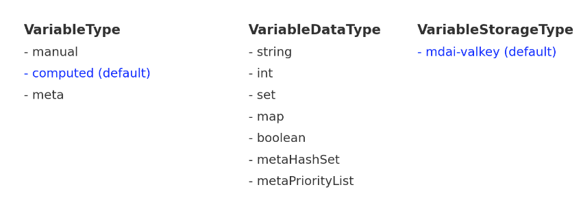

# MDAI Variables

MDAI Variables are a core concept in the MDAI ecosystem, serving as dynamic placeholders for values that can be managed, observed, and acted upon. They are defined within the `MdaiHub` custom resource and are stored in Valkey. These variables can be injected as environment variables into OTEL collectors, enabling dynamic configuration and behavior.

There are three main types of variables, distinguished by the `type` field:

1.  **Manual Variables**: Externally managed by users.
2.  **Computed Variables**: Internally managed by MDAI automation rules.
3.  **Meta Variables**: Derived from other manual and computed variables.

All variables share a common set of data types (`dataType`) and serialization options.

## Variable Types

### 1. Manual Variables (`type: manual`)

Manual variables are controlled and updated by external systems or users directly through the Valkey interface. They are not part of an automation loop and are not modified by MDAI automation rules. They are useful for providing static or externally managed configuration to your system.

**Allowed Data Types**: `string`, `int`, `boolean`, `set`, `map`

**Example:**

```yaml
# In MdaiHub spec
variables:
  - key: MANUAL_CONFIG_VALUE
    type: manual
    dataType: string
    serializeAs:
      - name: OTEL_MANUAL_CONFIG_VALUE
```
### 2. Computed Variables (type: computed)
   Computed variables are managed by the MDAI operator as part of an automation loop. Their values are updated by automationRules defined in the MdaiHub. These rules react to conditions (e.g., Prometheus alerts) and execute actions that modify the state of computed variables.
   **Allowed Data Types**: string, int, boolean, set, map  
   Example:
```yaml
# In MdaiHub spec
variables:
- key: DYNAMIC_SAMPLING_RATE
  type: computed
  dataType: int
  serializeAs:
    - name: OTEL_SAMPLING_RATE
```
### 3. Meta Variables (type: meta)
   Meta variables derive their values from one or more other variables (manual or computed). They are used to create composite or aggregated views of state. The calculation is based on their specific dataType.  
   **Allowed Data Types**: metaHashSet, metaPriorityList 
## Variable Data Types (dataType)
The dataType field specifies the kind of data a variable holds.
### Scalar Types
   These types hold a single value.   
   `string`: A simple string of text. Can be used to store complex data like YAML or JSON as a string.   
   `int`: An integer value. Stored as a string in Valkey.   
   `boolean`: A boolean value. Stored as "0" (false) or "1" (true) in Valkey.   
### Collection Types
   These types hold multiple values.   
   `set`: An unordered collection of unique strings, leveraging Valkey's Set data structure. Useful for managing lists of items where uniqueness is important.   
   `map`: A collection of key-value pairs, leveraging Valkey's Hash data structure. Both keys and values are strings.
### Meta Data Types
   These are special data types for meta variables.   
   `metaHashSet`: A lookup table. It takes an input/key variable and a lookup variable (which must be a map) and returns a string value from the map corresponding to the value of the key variable. Typical uses: feature flags, allowlists/denylists (when you only need membership), routing toggles, etc.   
   `metaPriorityList`: Takes a list of variableRefs and evaluates to the value of the first variable in the list that is not empty or null. Use cases: rule chains, routing preferences, fallbacks.
## Serialization (serializeAs)
   The serializeAs field defines how a variable's value is exposed to other components, typically as environment variables in an OTEL Collector. It is an array, allowing a single variable to be exposed in multiple ways or with different transformations.  
   `name`: The name of the environment variable.  
   `transformers`: An optional list of transformations to apply to the value before serialization. For example, a set can be joined into a single comma-separated string.  
   Example with Transformer:
````yaml
variables:
- key: ACTIVE_FEATURES
  type: computed
  dataType: set
  serializeAs:
    - name: OTEL_ACTIVE_FEATURES_CSV
      transformers:
        - type: join
          join:
          delimiter: ","
 ````
In this example, the ACTIVE_FEATURES set might contain ["featureA", "featureB"] in Valkey, but it will be injected as the environment variable OTEL_ACTIVE_FEATURES_CSV="featureA,featureB".

